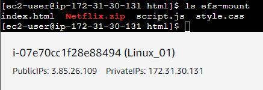
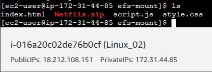

# Despliegue de una arquitectura EFS EC2 MultiAZ

## 1. Introducción

Vamos a montar una estructura con un clúster que consiste en dos máquinas EC2 las cuales se nutren de un sistema del sistema de archivos amazon EFS. Al frente del clúster se montará otra máquina EC2 que actuará como balanceador de carga y configurada como un proxy inverso.

## 2. Máquinas EC2 

Lo primero que vamos a hacer será crear los grupos de seguridad de nuestras máquinas:
  
Crearemos uno para los servidores web:  

Y otro Grupo de seguridad para el puerto 2049 por el cual solo podrán conectar las IPs del grupo de seguridad web que hemos creado anteriormente:  

Para poder conectarnos a ambas máquinas para configurarlas también abriremos el puerto 22 momentaneamente para poder acceder a ellas por SSH

A continuación crearemos las dos instancias que harán de servidores web. La primera máquina la pondremos en la zona 1a y la segunda en la 1b.

En el apartado de Datos de Usuario, al crear las máquinas añadiremos estos comandos para que se configuren las máquinas automáticamente tras su creación:

## 3. EFS

Para crear nuestro sistema de archivos EFS accedemos a la pestaña del mismo nombre.

 

Configuración EFS

## 4. Configuración Servidores web

Accedemos a elas máquinas mediante SSH
Comprobamos que se han instalado los servicios que queriamos durante la creación.

En la ruta /var/www/html crearemos el directorio “efs-mount” 

Montamos el sistema de archivos con el comando indicado en ambas máquinas

Aqui se observa que ambas máquinas comparten el mismo punto de montaje  y el mismo sistema de archivos, compartiendo los archivos que hay en él.

## 5. Creación Balanceador de carga

- Crearemos una instancia con el sistema operativo Ubuntu. La configuración inicial será la normal. En datos de usuario pondremos el siguiente script:

#!/bin/bash  
sudo apt update -y   
sudo apt install apache2 -y  
sudo apt install php -y  
sudo apt install libapache2-mod-php -y  
sudo apt install mysql-server -y  
sudo apt install php-mysql -y  

- Asignaremos IP elásticas a todas nuestra máquinas con IP privadas para hacer que solo puedan verse entre ellas.

- Crearemos un grupo de seguridad para el balanceador también.

- Añadimos estos comandos uno por uno para habilitarlo como balanceador y como proxy inverso:

a2enmod proxy  
a2enmod proxy_http  
a2enmod proxy_ajp  
a2enmod rewrite  
a2enmod deflate  
a2enmod headers  
a2enmod proxy_balancer  
a2enmod proxy_connect  
a2enmod proxy_html  
a2enmod lbmethod_byrequests  

- Reiniciamos apache en nuestra máquina

- Procedemos a modificar el archivo 000-default.conf

En la captura anterior falta la líne ade código:

ProxyPass /balancer-manager !

Esta línea también es necesaria para que el balanceador actue como proxy inverso.

- Ahora podemos comprobar que si ponemos la IP del balanceador nos muestra la página alojada

## 6. Securizar

 En el grupo de seguridad Web dejaremos abierto el puerto 80 pero solo para que pueda verse con nuestro balanceador

 

El grupo de seguridad del balanceador solo dejaremos abierto el puerto 80 a cualquier IP para que pueda verse públicamente

 ## IP DEL BALANCEADOR: 54.167.108.219
